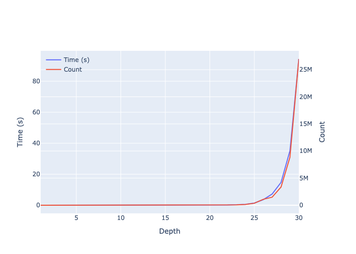
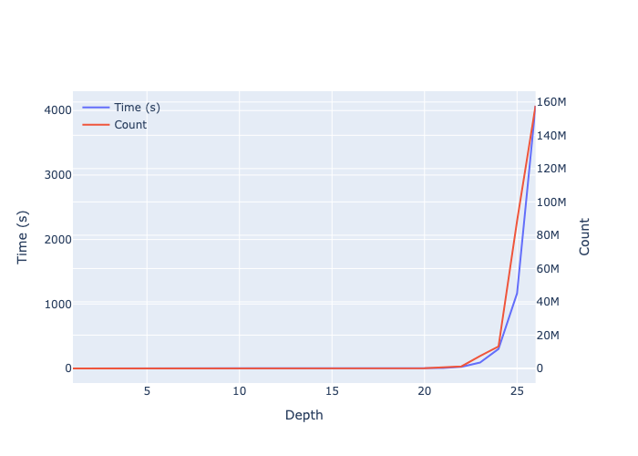

# Overview

- Related Work? Redex. Whatever Justine cites.
- Simply Typed Lambda Calculus.
- Benchmark.
- Intermission: How does it work?
- System F Omega.
- Benchmark.

# Introduction

```haskell
import Control.Enumerable
import Control.Search
import Data.Coolean
```

<!--
```haskell
import Data.Bits
import Data.Foldable (traverse_)
import Data.List (transpose)
import Data.Proxy (Proxy (..))
import qualified Options.Applicative as O
import Prelude hiding (lookup)
import Text.Printf (printf)
```
-->

# Simply-Typed Lambda Calculus {#simp}

```haskell
data Z
data S n = FZ | FS n
```

```haskell
deriving instance Eq Z
deriving instance Eq n => Eq (S n)
deriving instance Functor S
deriving instance Show Z
deriving instance Show n => Show (S n)
```

```haskell
instance Enumerable Z where
  enumerate = share . aconcat $ []

instance Enumerable n => Enumerable (S n) where
  enumerate = share . aconcat $ [c0 FZ, c1 FS]
```

:::mathpar
$r,s,t
\Coloneqq \star
     \mid s \Rightarrow t$
:::

```haskell
data SimpTy
  = Star
  | SimpTy :=> SimpTy
```

```haskell
deriving instance Eq SimpTy
deriving instance Show SimpTy
deriveEnumerable ''SimpTy
```

:::mathpar
$e,f,g
\Coloneqq x
     \mid \lambda x.e
     \mid f \; e^t$
:::

```haskell
data SimpTm tm
  = Var tm
  | Lam (SimpTm (S tm))
  | App (SimpTm tm) (SimpTm tm) SimpTy
```

```haskell
deriving instance Eq tm => Eq (SimpTm tm)
deriving instance Show tm => Show (SimpTm tm)
deriveEnumerable ''SimpTm
```

:::mathpar
$\Gamma
\Coloneqq \text{nil}
     \mid \Gamma \rhd x : t$
:::

```haskell
type SimpTyCtx tm = tm -> SimpTy
```

```haskell
nil :: Z -> a
nil n = case n of {}
```

```haskell
(|>) :: (n -> a) -> a -> (S n -> a)
(fs |> fz) FZ      = fz
(fs |> fz) (FS n)  = fs n
```

```haskell
checkSimpTm :: SimpTyCtx tm -> SimpTm tm -> SimpTy -> Cool
```

:::mathpar
$\begin{prooftree}
\AXC{\(x : t \in \Gamma\)}
\RL{Var}
\UIC{\(\Gamma \vdash x : t\)}
\end{prooftree}$
:::

```haskell
checkSimpTm gam (Var x) t =
  toCool (gam x == t)
```

:::mathpar
$\begin{prooftree}
\AXC{\(\Gamma \rhd x : s \vdash e : t \)}
\RL{Lam}
\UIC{\(\Gamma \vdash \lambda x.e : s \Rightarrow t\)}
\end{prooftree}$
:::

```haskell
checkSimpTm gam (Lam e) (s :=> t) =
  checkSimpTm (gam |> s) e t
```

:::mathpar
$\begin{prooftree}
\AXC{\(\Gamma \vdash f : s \Rightarrow t \)}
\AXC{\(\Gamma \vdash e : s \)}
\RL{App}
\BIC{\(\Gamma \vdash f \; e^s : t\)}
\end{prooftree}$
:::

```haskell
checkSimpTm gam (App f e s) t =
  checkSimpTm gam f (s :=> t)
  &&&
  checkSimpTm gam e s
```

```haskell
checkSimpTm _ _ _ = false
```

```haskell
checkClosedSimpTm :: SimpTm Z -> SimpTy -> Cool
checkClosedSimpTm e t = checkSimpTm nil e t
```

```haskell
enumClosedSimpTm :: Int -> SimpTy -> IO [SimpTm Z]
enumClosedSimpTm depth t = search depth (`checkClosedSimpTm` t)
```

Here's all the terms of type $\star\Rightarrow\star$ of size $\leq 10$:
<!-- GENERATED BY: cabal run lets-list-all-programs -v0 -- list --system=STLC -d 10 -->

:::mathpar
$λx.x$
$λx.(λy.y) \; x^\star$
$λx.(λy.y) \; ((λz.z) \; x^\star)^\star$
$λx.(λy.y) \; ((λz.x) \; x^\star)^\star$
$λx.(λy.x) \; x^\star$
$λx.(λy.x) \; (λz.z)^{\star ⇒ \star}$
$λx.(λy.x) \; (λz.x)^{\star ⇒ \star}$
$λx.(λy.x) \; ((λz.z) \; x^\star)^\star$
$λx.(λy.x) \; ((λz.x) \; x^\star)^\star$
$λx.(λy.(λz.z) \; y^\star) \; x^\star$
$λx.(λy.(λz.z) \; x^\star) \; x^\star$
$λx.(λy.(λz.y) \; y^\star) \; x^\star$
$λx.(λy.(λz.y) \; x^\star) \; x^\star$
$λx.(λy.(λz.x) \; y^\star) \; x^\star$
$λx.(λy.(λz.x) \; x^\star) \; x^\star$
$λx.(λy.λz.z) \; x^\star \; x^\star$
$λx.(λy.λz.y) \; x^\star \; x^\star$
$λx.(λy.λz.x) \; x^\star \; x^\star$
$(λx.x) \; (λy.y)^{\star ⇒ \star}$
$(λx.λy.y) \; (λz.z)^{\star ⇒ \star}$
:::



<!--

Pretty Printer
================================================================================

```haskell
type Name = String
```

```haskell
xyzws :: [Name]
xyzws = concat . transpose $ [xs, ys, zs, ws]
 where
  xs = "x" : ['x' : show i | i <- [1..]]
  ys = "y" : ['y' : show i | i <- [1..]]
  zs = "z" : ['z' : show i | i <- [1..]]
  ws = "w" : ['w' : show i | i <- [1..]]
```

```haskell
type NameCtx tm = tm -> Name
```

```haskell
arr_prec, lam_prec, app_prec :: Int
arr_prec = 2
lam_prec = 10
app_prec = 11
```

```haskell
showsPrecSimpTy ::
  Int        -> -- precedence
  SimpTy     -> -- type to show
  ShowS
showsPrecSimpTy p = \case
  Star    -> showString "★"
  s :=> t -> showParen (p > arr_prec) shows_s_arr_t
   where
    shows_s = showsPrecSimpTy (arr_prec + 1) s
    shows_t = showsPrecSimpTy arr_prec t
    shows_s_arr_t = shows_s . showString " ⇒ " . shows_t
```

```haskell
showsPrecSimpTm ::
  Int        -> -- precedence
  [Name]     -> -- fresh names
  NameCtx tm -> -- bound names
  SimpTm tm  -> -- term to show
  (ShowS, [Name])
showsPrecSimpTm p fresh gam = \case
  Var x ->
    (shows_var_x, fresh)
    where
    shows_var_x = showString (gam x)
  Lam e ->
    (showParen (p > lam_prec) shows_lam_e, fresh2)
    where
    (x : fresh1) = fresh
    (shows_e, fresh2) = showsPrecSimpTm lam_prec fresh1 (gam |> x) e
    shows_lam_e = showString ("λ" <> x <> ".") . shows_e
  App f e s ->
    (showParen (p > app_prec) shows_app_f_e, fresh2)
    where
    (shows_f, fresh1) = showsPrecSimpTm app_prec fresh gam f
    (shows_e, fresh2) = showsPrecSimpTm (app_prec + 1) fresh1 gam e
    shows_s = showsPrecSimpTy (app_prec + 1) s
    shows_app_f_e = shows_f . showString " " . shows_e . showString "^" . shows_s
```

```haskell
newtype Pretty a = Pretty a

pretty :: Show (Pretty a) => a -> String
pretty = show . Pretty

instance Show (Pretty (SimpTm Z)) where
  showsPrec :: Int -> Pretty (SimpTm Z) -> ShowS
  showsPrec p (Pretty e) = fst (showsPrecSimpTm p xyzws nil e)
```

-->

# Polymorphic Lambda Calculus – System Fω {#poly}

:::mathpar
$k
\Coloneqq \star
     \mid k \Rightarrow k'$
:::

<!--
```haskell
type Ki = SimpTy
```
-->

```hs
data Ki
  = Star
  | Ki :=> Ki
```

:::mathpar
$r,s,t
\Coloneqq a
     \mid \lambda a.t
     \mid s \; t^k
     \mid \bot
     \mid s \to t
     \mid \forall a^k.t$
:::

```haskell
data Ty ty
   = TyVar ty
   | TyLam (Ty (S ty))
   | TyApp (Ty ty) (Ty ty) Ki
   | TyBot
   | Ty ty :-> Ty ty
   | TyAll Ki (Ty (S ty))
```

```haskell
deriving instance Eq ty => Eq (Ty ty)
deriving instance Functor Ty
deriving instance Show ty => Show (Ty ty)
deriveEnumerable ''Ty
```

:::mathpar
$\Delta
\Coloneqq \text{nil}
     \mid \Delta \rhd a : k$
:::

```haskell
type KiCtx ty = ty -> Ki
```

```haskell
checkTy :: KiCtx ty -> Ty ty -> Ki -> Cool
```

:::mathpar
$\begin{prooftree}
\AXC{\(a : k \in \Delta\)}
\RL{TyVar}
\UIC{\(\Delta \vdash a : k\)}
\end{prooftree}$
:::

```haskell
checkTy del (TyVar a) k =
  toCool (del a == k)
```

:::mathpar
$\begin{prooftree}
\AXC{\(\Delta \rhd a : k \vdash s : k' \)}
\RL{TyLam}
\UIC{\(\Delta \vdash \lambda a.s : k \Rightarrow k'\)}
\end{prooftree}$
:::

```haskell
checkTy del (TyLam s) (k :=> k') =
  checkTy (del |> k) s k'
```

:::mathpar
$\begin{prooftree}
\AXC{\(\Delta \vdash s : k \Rightarrow k' \)}
\AXC{\(\Delta \vdash t : k \)}
\RL{TyApp}
\BIC{\(\Delta \vdash s \; t^k : k'\)}
\end{prooftree}$
:::

```haskell
checkTy del (TyApp s t k) k' =
  checkTy del s (k :=> k')
  &&&
  checkTy del t k
```

:::mathpar
$\begin{prooftree}
\AXC{}
\RL{TyBot}
\UIC{\(\Delta \vdash \bot : \star\)}
\end{prooftree}$
:::

```haskell
checkTy del TyBot Star =
  true
```

:::mathpar
$\begin{prooftree}
\AXC{\(\Delta \vdash s : \star \)}
\AXC{\(\Delta \vdash t : \star \)}
\RL{\((\to)\)}
\BIC{\(\Delta \vdash s \to t : \star\)}
\end{prooftree}$
:::

```haskell
checkTy del (s :-> t) Star =
  checkTy del s Star
  &&&
  checkTy del t Star
```

:::mathpar
$\begin{prooftree}
\AXC{\(\Delta \rhd a : k \vdash s : \star \)}
\RL{TyAll}
\UIC{\(\Delta \vdash \forall a^k. s : \star\)}
\end{prooftree}$
:::

```haskell
checkTy del (TyAll k s) Star =
  checkTy (del |> k) s Star
```

```haskell
checkTy _ _ _ = false
```

```haskell
checkClosedTy :: Ty Z -> Ki -> Cool
checkClosedTy t k = checkTy nil t k
```

```haskell
enumClosedTy :: Int -> Ki -> IO [Ty Z]
enumClosedTy depth k = search depth (`checkClosedTy` k)
```

Here's all the types of kind $\star$ of size $\leq 5$:
<!-- GENERATED BY: cabal run lets-list-all-programs -v0 -- list --system=FwTy -d 5 -->

:::mathpar
$⊥$
$⊥ → ⊥$
$⊥ → ⊥ → ⊥$
$⊥ → ∀a^\star.a$
$⊥ → ∀a^\star.⊥$
$(⊥ → ⊥) → ⊥$
$∀a^\star.a → ⊥$
$∀a^\star.⊥ → ⊥$
$∀a^\star.a$
$∀a^\star.⊥$
$∀a^\star.(a → a)$
$∀a^\star.(a → ⊥)$
$∀a^\star.(⊥ → a)$
$∀a^\star.(⊥ → ⊥)$
$∀a^\star.∀b^\star.b$
$∀a^\star.∀b^\star.a$
$∀a^\star.∀b^\star.⊥$
$(λa.a) \; ⊥^\star$
$(λa.⊥) \; ⊥^\star$
:::

<!--

Pretty Printer
================================================================================

```haskell
abcds :: [Name]
abcds = concat . transpose $ [as, bs, cs, ds]
 where
  as = "a" : ['a' : show i | i <- [1..]]
  bs = "b" : ['b' : show i | i <- [1..]]
  cs = "c" : ['c' : show i | i <- [1..]]
  ds = "d" : ['d' : show i | i <- [1..]]
```

```haskell
all_prec :: Int
all_prec = 9
```

```haskell
showsPrecTy ::
  Int        -> -- precedence
  [Name]     -> -- fresh names
  NameCtx ty -> -- bound names
  Ty ty      -> -- type to show
  (ShowS, [Name])
showsPrecTy p fresh del = \case
  TyVar a ->
    (shows_var_a, fresh)
    where
    shows_var_a = showString (del a)
  TyLam s ->
    (showParen (p > lam_prec) shows_lam_s, fresh2)
    where
    (a : fresh1) = fresh
    (shows_s, fresh2) = showsPrecTy lam_prec fresh1 (del |> a) s
    shows_lam_s = showString ("λ" <> a <> ".") . shows_s
  TyApp s t k ->
    (showParen (p > app_prec) shows_app_s_t, fresh2)
    where
    (shows_s, fresh1) = showsPrecTy app_prec fresh del s
    (shows_t, fresh2) = showsPrecTy (app_prec + 1) fresh1 del t
    shows_k = showsPrecSimpTy (app_prec + 1) k
    shows_app_s_t = shows_s . showString " " . shows_t . showString "^" . shows_k
  TyBot ->
    (showString "⊥", fresh)
  s :-> t ->
    (showParen (p > arr_prec) shows_s_arr_t, fresh2)
    where
    (shows_s, fresh1) = showsPrecTy (arr_prec + 1) fresh del s
    (shows_t, fresh2) = showsPrecTy arr_prec fresh1 del t
    shows_s_arr_t = shows_s . showString " → " . shows_t
  TyAll k s ->
    (showParen (p > all_prec) shows_all_s, fresh2)
    where
    (a : fresh1) = fresh
    shows_k = showsPrecSimpTy (all_prec + 1) k
    (shows_s, fresh2) = showsPrecTy all_prec fresh1 (del |> a) s
    shows_all_s = showString "∀" . showString a . showString "^" . shows_k . showString "." . shows_s
```

```haskell
instance Show (Pretty (Ty Z)) where
  showsPrec :: Int -> Pretty (Ty Z) -> ShowS
  showsPrec p (Pretty s) = fst (showsPrecTy p abcds nil s)
```

-->

```haskell
newtype Norm a = Norm a
newtype Neut a = Neut a
```

```haskell
deriving instance Eq a => Eq (Norm a)
deriving instance Eq a => Eq (Neut a)
deriving instance Show a => Show (Norm a)
deriving instance Show a => Show (Neut a)
```

:::mathpar
$\text{Norm} \; r
\Coloneqq s
     \mid \lambda a.r$

$\text{Neut} \; s,t
\Coloneqq \bot
     \mid s \to t
     \mid \forall a^k.s
     \mid a
     \mid s \; t^k$
:::

```haskell
instance Enumerable ty => Enumerable (Norm (Ty ty)) where
  enumerate = share . aconcat $
    [       c1 $ \(Neut s) -> Norm s
    , pay . c1 $ \(Norm s) -> Norm (TyLam s)
    ]

instance Enumerable ty => Enumerable (Neut (Ty ty)) where
  enumerate = share . aconcat . fmap pay $
    [  c0  $                         Neut TyBot
    ,  c2  $ \(Neut s) (Neut t)   -> Neut (s :-> t)
    ,  c2  $ \k        (Neut s)   -> Neut (TyAll k s)
    ,  c1  $ \a                   -> Neut (TyVar a)
    ,  c3  $ \(Neut s) (Norm t) k -> Neut (TyApp s t k)
    ]
```

:::mathpar
$\sigma
\Coloneqq \text{nil}
     \mid \sigma \rhd a \mapsto t$
:::

```haskell
type TySub ty ty' = ty -> Ty ty'
```

```haskell
refl :: TySub ty ty
refl = TyVar
```

```haskell
weak :: TySub ty ty' -> TySub ty (S ty')
weak sig = fmap FS . sig
```

```haskell
sub :: TySub ty ty' -> Ty ty -> Ty ty'
sub sig = \case
  TyVar a     -> sig a
  TyLam s     -> TyLam (sub (weak sig |> TyVar FZ) s)
  TyApp s t k -> TyApp (sub sig s) (sub sig t) k
  TyBot       -> TyBot
  s :-> t     -> sub sig s :-> sub sig t
  TyAll k s   -> TyAll k (sub (weak sig |> TyVar FZ) s)
```

```haskell
pattern TyRed :: Ty (S ty) -> Ty ty -> Ki -> Ty ty
pattern TyRed s t k = TyApp (TyLam s) t k
```

```haskell
step :: Ty ty -> Maybe (Ty ty)
step = \case
  TyVar a     -> empty
  TyLam s     -> TyLam <$> step s
  TyRed s t k -> pure (sub (refl |> t) s)
  TyApp s t k -> (TyApp <$> step s <*> pure t <*> pure k)
             <|> (TyApp <$> pure s <*> step t <*> pure k)
  TyBot       -> empty
  s :-> t     -> ((:->) <$> step s <*> pure t)
             <|> ((:->) <$> pure s <*> step t)
  TyAll k s   -> TyAll <$> pure k <*> step s
```

```haskell
norm :: Ty ty -> Ty ty
norm t = maybe t norm (step t)
```

:::mathpar
$e,f,g
\Coloneqq x
     \mid \lambda x.e
     \mid f \; e^t
     \mid \Lambda a.e
     \mid e^{\forall a^k.s} \; t$
:::

```haskell
data Tm ty tm
  = TmVar tm
  | TmLam (Tm ty (S tm))
  | TmApp (Tm ty tm) (Tm ty tm) (Norm (Ty ty))
  | TmLAM (Tm (S ty) tm)
  | TmAPP (Tm ty tm) (Norm (Ty (S ty))) (Norm (Ty ty)) Ki
```

```haskell
deriving instance (Eq ty, Eq tm) => Eq (Tm ty tm)
deriving instance (Show ty, Show tm) => Show (Tm ty tm)
deriveEnumerable ''Tm
```

:::mathpar
$\Gamma
\Coloneqq \text{nil}
     \mid \Gamma \rhd x : t$
:::

```haskell
type TyCtx ty tm = tm -> Ty ty
```

```haskell
checkTm ::
  Eq ty =>
  KiCtx ty -> TyCtx ty tm -> Tm ty tm -> Ty ty -> Cool
```

:::mathpar
$\begin{prooftree}
\AXC{\(x : t \in \Gamma\)}
\RL{TmVar}
\UIC{\(\Delta; \Gamma \vdash x : t\)}
\end{prooftree}$
:::

```haskell
checkTm del gam (TmVar x) t =
  toCool (gam x == t)
```

:::mathpar
$\begin{prooftree}
\AXC{\(\Delta; \Gamma \rhd x : s \vdash e : t\)}
\RL{TmLam}
\UIC{\(\Delta; \Gamma \vdash \lambda x.e : s \to t\)}
\end{prooftree}$
:::

```haskell
checkTm del gam (TmLam e) (s :-> t) =
  checkTm del (gam |> s) e t
```

:::mathpar
$\begin{prooftree}
\AXC{\(\Delta; \Gamma \vdash f : s \to t \)}
\AXC{\(\Delta; \Gamma \vdash e : s \)}
\RL{TmApp}
\BIC{\(\Delta; \Gamma \vdash f \; e^s : t\)}
\end{prooftree}$
:::

```haskell
checkTm del gam (TmApp f e (Norm s)) t =
  checkTm del gam f (s :-> t)
  &&&
  checkTm del gam e s
```

:::mathpar
$\begin{prooftree}
\AXC{\(\Delta \rhd a:k; \Gamma \vdash e : t[b \coloneqq a]\)}
\RL{TmLAM}
\UIC{\(\Delta; \Gamma \vdash \Lambda a.e : \forall b^k.t\)}
\end{prooftree}$
:::

```haskell
checkTm del gam (TmLAM e) (TyAll k t) =
  checkTm (del |> k) (weak gam) e t
```

:::mathpar
$\begin{prooftree}
\AXC{\(\Delta \vdash t : k\)}
\AXC{\(\Delta; \Gamma \vdash e : \forall a^k.s\)}
\AXC{\(s[a \coloneqq t] = r\)}
\RL{TmAPP}
\TIC{\(\Delta; \Gamma \vdash e^{\forall a^k.s} \; t : r\)}
\end{prooftree}$
:::

```haskell
checkTm del gam (TmAPP e (Norm s) (Norm t) k) r =
  (
    checkTy del all Star
    !&&
    checkTm del gam e all
  )
  &&&
  (
    (
      checkTy del t k
      &&&
      checkTy del red Star
    )
    !&&
    toCool (norm red == r)
  )
 where
  all = TyAll k s
  red = TyRed s t k
```

```haskell
checkTm _ _ _ _ = false
```

```haskell
checkClosedTm :: Tm Z Z -> Ty Z -> Cool
checkClosedTm e t = checkTm nil nil e t
```

```haskell
enumClosedTm :: Int -> Ty Z -> IO [Tm Z Z]
enumClosedTm depth k = search depth (`checkClosedTm` k)
```

Here's all the terms of type $\bot\to\bot$ of size $\leq 10$:
<!-- GENERATED BY: cabal run lets-list-all-programs -v0 -- list --system=Fw -d 10 -->

:::mathpar
$λx.x$
$λx.(λy.y) \; x^⊥$
$λx.(λy.y) \; ((λz.z) \; x^⊥)^⊥$
$λx.(λy.y) \; ((λz.x) \; x^⊥)^⊥$
$λx.(λy.x) \; x^⊥$
$λx.(λy.x) \; (λz.z)^{⊥ → ⊥}$
$λx.(λy.x) \; (λz.x)^{⊥ → ⊥}$
$λx.(λy.x) \; (Λa.x)^{∀b^★.⊥}$
$λx.(λy.x) \; ((λz.z) \; x^⊥)^⊥$
$λx.(λy.x) \; ((λz.x) \; x^⊥)^⊥$
$λx.(λy.(λz.z) \; y^⊥) \; x^⊥$
$λx.(λy.(λz.z) \; x^⊥) \; x^⊥$
$λx.(λy.(λz.y) \; y^⊥) \; x^⊥$
$λx.(λy.(λz.y) \; x^⊥) \; x^⊥$
$λx.(λy.(λz.x) \; y^⊥) \; x^⊥$
$λx.(λy.(λz.x) \; x^⊥) \; x^⊥$
$λx.(λy.λz.z) \; x^⊥ \; x^⊥$
$λx.(λy.λz.y) \; x^⊥ \; x^⊥$
$λx.(λy.λz.x) \; x^⊥ \; x^⊥$
$λx.(Λa.x)^{∀b^\star.⊥} \; ⊥$
$λx.(Λa.x)^{∀b^\star.⊥} \; (⊥ → ⊥)$
$λx.(Λa.x)^{∀b^\star.⊥} \; (∀c^\star.⊥)$
$λx.(Λa.x)^{∀b^\star.⊥} \; (∀c^\star.c)$
$λx.(Λa.x)^{∀b^{\star ⇒ \star}.⊥} \; (λc.⊥)$
$λx.(Λa.x)^{∀b^{\star ⇒ \star}.⊥} \; (λc.c)$
$(λx.x) \; (λy.y)^{⊥ → ⊥}$
$(λx.λy.y) \; (λz.z)^{⊥ → ⊥}$
$(Λa.λx.x)^{∀b^\star.(⊥ → ⊥)} \; ⊥$
$(Λa.λx.x)^{∀b^\star.(b → b)} \; ⊥$
:::



@Grygiel2012 ask

<!--

Pretty Printer
================================================================================

```haskell
showsPrecTm ::
  Int        -> -- precedence
  [Name]     -> -- fresh type names
  [Name]     -> -- fresh term names
  NameCtx ty -> -- bound type names
  NameCtx tm -> -- bound term names
  Tm ty tm   -> -- type to show
  (ShowS, ([Name], [Name]))
showsPrecTm p freshTy freshTm del gam = \case
  TmVar x ->
    (shows_var_x, (freshTy, freshTm))
    where
    shows_var_x = showString (gam x)
  TmLam e ->
    (showParen (p > lam_prec) shows_lam_e, (freshTy1, freshTm2))
    where
    (x : freshTm1) = freshTm
    (shows_e, (freshTy1, freshTm2)) = showsPrecTm lam_prec freshTy freshTm1 del (gam |> x) e
    shows_lam_e = showString ("λ" <> x <> ".") . shows_e
  TmApp f e (Norm s) ->
    (showParen (p > app_prec) shows_app_f_e, (freshTy3, freshTm2))
    where
    (shows_f, (freshTy1, freshTm1)) = showsPrecTm app_prec freshTy freshTm del gam f
    (shows_e, (freshTy2, freshTm2)) = showsPrecTm (app_prec + 1) freshTy1 freshTm1 del gam e
    (shows_s, freshTy3) = showsPrecTy (app_prec + 1) freshTy2 del s
    shows_app_f_e = shows_f . showString " " . shows_e . showString "^" . shows_s
  TmLAM e ->
    (showParen (p > lam_prec) shows_LAM_e, (freshTy2, freshTm1))
    where
    (a : freshTy1) = freshTy
    (shows_e, (freshTy2, freshTm1)) = showsPrecTm lam_prec freshTy1 freshTm (del |> a) gam e
    shows_LAM_e = showString ("Λ" <> a <> ".") . shows_e
  TmAPP e (Norm s) (Norm t) k ->
    (showParen (p > app_prec) shows_app_e_t, (freshTy3, freshTm1))
   where
    (shows_e, (freshTy1, freshTm1)) = showsPrecTm (app_prec + 1) freshTy freshTm del gam e
    (shows_all_a_k_s, freshTy2) = showsPrecTy (app_prec + 1) freshTy1 del (TyAll k s)
    (shows_t, freshTy3) = showsPrecTy (app_prec + 1) freshTy2 del t
    shows_app_e_t = shows_e . showString "^" . shows_all_a_k_s . showString " " . shows_t
```

```haskell
instance Show (Pretty (Tm Z Z)) where
  showsPrec :: Int -> Pretty (Tm Z Z) -> ShowS
  showsPrec p (Pretty e) = fst (showsPrecTm p abcds xyzws nil nil e)
```

-->

# Simply-Typed Linear Lambda Calculus

```haskell
class    Eq  n => Fin    n  where toInt :: n -> Int
instance          Fin  Z    where toInt = nil
instance Fin n => Fin (S n) where toInt = (((+1) . toInt) |> 0)
```

```haskell
class Usage use where
  zero  :: use n
  use   :: Fin n => n -> use n
  pop   :: use (S n) -> (Cool, use n)
  (.+.) :: use n -> use n -> (Cool, use n)
```

```haskell
newtype Lin tm = Lin Int
```

```haskell
instance Usage Lin where
  zero = Lin 0
  use n = Lin (bit . toInt $ n)
  pop (Lin u) = (toCool $ testBit u 0, Lin $ shift u (-1))
  Lin u .+. Lin v = (toCool $ u .&. v == 0, Lin $ u .|. v)
```

```haskell
instance Semigroup Cool where (<>)   = (&&&)
instance Monoid    Cool where mempty = true
```

```haskell
inferUsageSimpTm ::
  (Usage tmUse, Fin tm) =>
  SimpTm tm -> (Cool, tmUse tm)
inferUsageSimpTm = \case
  Var x -> do
    pure (use x)
  Lam e -> do
    eTmUse <- inferUsageSimpTm e
    pop eTmUse
  App f e s -> do
    fTmUse <- inferUsageSimpTm f
    eTmUse <- inferUsageSimpTm e
    fTmUse .+. eTmUse
```

<!--
```haskell
{-# SPECIALISE
  inferUsageSimpTm ::
    (Fin tm) =>
    SimpTm tm -> (Cool, Lin tm)
  #-}
```
-->

```haskell
checkClosedSimpLinTm :: SimpTm Z -> SimpTy -> Cool
checkClosedSimpLinTm e t =
  checkClosedSimpTm e t
  &&&
  fst (inferUsageSimpTm @Lin e)
```

```haskell
enumClosedSimpLinTm :: Int -> SimpTy -> IO [SimpTm Z]
enumClosedSimpLinTm depth t =
  search depth (`checkClosedSimpLinTm` t)
```

Here's all the linear terms of type $\star\Rightarrow\star$ of size $\leq 10$:
<!-- GENERATED BY: cabal run lets-list-all-programs -v0 -- list --system=STLLC -d 10 -->

:::mathpar
$λx.x$
$λx.(λy.y) \; x^\star$
$λx.(λy.y) \; ((λz.z) \; x^\star)^\star$
$λx.(λy.(λz.z) \; y^\star) \; x^\star$
$(λx.x) \; (λy.y)^{\star ⇒ \star}$
:::

# Polymorphic Linear Lambda Calculus

```haskell
inferUsageTm ::
  (Usage tmUse, Fin tm) => Tm ty tm -> (Cool, tmUse tm)
inferUsageTm = \case
  TmVar x -> do
    pure (use x)
  TmLam e -> do
    eTmUse <- inferUsageTm e
    pop eTmUse
  TmApp f e s -> do
    fTmUse <- inferUsageTm f
    eTmUse <- inferUsageTm e
    fTmUse .+. eTmUse
  TmLAM e -> do
    inferUsageTm e
  TmAPP e s t k -> do
    inferUsageTm e
```

<!--
```haskell
{-# SPECIALISE
  inferUsageTm ::
    (Fin tm) =>
    Tm ty tm -> (Cool, Lin tm)
  #-}
```
-->

```haskell
checkClosedLinTm :: Tm Z Z -> Ty Z -> Cool
checkClosedLinTm e t =
  checkClosedTm e t
  &&&
  fst (inferUsageTm @Lin e)
```

```haskell
enumClosedLinTm :: Int -> Ty Z -> IO [Tm Z Z]
enumClosedLinTm depth t =
  search depth (`checkClosedLinTm` t)
```

Here's all the linear terms of type $\bot\to\bot$ of size $\leq 10$:
<!-- GENERATED BY: cabal run lets-list-all-programs -v0 -- list --system=LFw -d 10 -->

:::mathpar
$λx.x$
$λx.(λy.y) \; x^⊥$
$λx.(λy.y) \; ((λz.z) \; x^⊥)^⊥$
$λx.(λy.(λz.z) \; y^⊥) \; x^⊥$
$λx.(Λa.x)^{∀b^★.⊥} \; ⊥$
$λx.(Λa.x)^{∀b^★.⊥} \; (⊥ → ⊥)$
$λx.(Λa.x)^{∀b^★.⊥} \; (∀c^★.⊥)$
$λx.(Λa.x)^{∀b^★.⊥} \; (∀c^★.c)$
$λx.(Λa.x)^{∀b^{★ ⇒ ★}.⊥} \; (λc.⊥)$
$λx.(Λa.x)^{∀b^{★ ⇒ ★}.⊥} \; (λc.c)$
$(λx.x) \; (λy.y)^{⊥ → ⊥}$
$(Λa.λx.x)^{∀b^★.(⊥ → ⊥)} \; ⊥$
$(Λa.λx.x)^{∀b^★.(b → b)} \; ⊥$
:::

```haskell
inferUsageTy ::
  (Usage tyUse, Fin ty) => Ty ty -> (Cool, tyUse ty)
inferUsageTy = \case
  TyVar a -> do
    pure (use a)
  TyLam s -> do
    sTyUse <- inferUsageTy s
    pop sTyUse
  TyApp s t k -> do
    sTyUse <- inferUsageTy s
    tTyUse <- inferUsageTy t
    sTyUse .+. tTyUse
  TyBot -> do
    pure zero
  s :-> t -> do
    sTyUse <- inferUsageTy s
    tTyUse <- inferUsageTy t
    sTyUse .+. tTyUse
  TyAll k s -> do
    sTyUse <- inferUsageTy s
    pop sTyUse
```

```haskell
checkClosedLinTy :: Ty Z -> Ki -> Cool
checkClosedLinTy t k =
  checkClosedTy t k
  &&&
  fst (inferUsageTy @Lin t)
```

```haskell
enumClosedLinTy :: Int -> Ki -> IO [Ty Z]
enumClosedLinTy depth t =
  search depth (`checkClosedLinTy` t)
```

Here's all the linear types of kind $\star\Rightarrow\star$ of size $\leq 5$:
<!-- GENERATED BY: cabal run lets-list-all-programs -v0 -- list --system=LLFwTy -d 5 -->

:::mathpar
$⊥$
$⊥ → ⊥$
$⊥ → ⊥ → ⊥$
$⊥ → ∀a^★.a$
$(⊥ → ⊥) → ⊥$
$∀a^★.a → ⊥$
$∀a^★.a$
$∀a^★.(a → ⊥)$
$∀a^★.(⊥ → a)$
$(λa.a) \; ⊥^★$
:::

```haskell
inferUsageTyTm ::
  (Usage tyUse, Usage tmUse, Fin ty, Fin tm) =>
  Proxy tyUse -> Tm ty tm -> (Cool, tmUse tm)
inferUsageTyTm (p :: Proxy tyUse) = \case
  TmVar x -> do
    pure (use x)
  TmLam e -> do
    eTmUse <- inferUsageTyTm p e
    pop eTmUse
  TmApp f e (Norm s) -> do
    _sTyUse <- inferUsageTy @tyUse s
    fTmUse <- inferUsageTyTm p f
    eTmUse <- inferUsageTyTm p e
    fTmUse .+. eTmUse
  TmLAM e -> do
    inferUsageTyTm p e
  TmAPP e (Norm s) (Norm t) k -> do
    _sTyUse <- inferUsageTy @tyUse (TyAll k s)
    _tTyUse <- inferUsageTy @tyUse t
    inferUsageTyTm p e
```

```haskell
inferUsageTyTmAlt ::
  (Usage tyUse, Usage tmUse, Fin ty, Fin tm) =>
  Tm ty tm -> Ty ty -> (Cool, (tyUse ty, tmUse tm))
inferUsageTyTmAlt (TmVar x) t = do
  tTyUse <- inferUsageTy t
  let xTmUse = use x
  pure (tTyUse, xTmUse)
inferUsageTyTmAlt (TmLam e) (s :-> t) = do
  sTyUse <- inferUsageTy s
  (eTyUse, eTmUse) <- inferUsageTyTmAlt e t
  lamTyUse <- sTyUse .+. eTyUse
  lamTmUse <- pop eTmUse
  pure (lamTyUse, lamTmUse)
inferUsageTyTmAlt (TmApp f e (Norm s)) t = do
  (fTyUse, fTmUse) <- inferUsageTyTmAlt f (s :-> t)
  (eTyUse, eTmUse) <- inferUsageTyTmAlt e s
  appTyUse <- fTyUse .+. eTyUse
  appTmUse <- fTmUse .+. eTmUse
  pure (appTyUse, appTmUse)
inferUsageTyTmAlt (TmLAM e) (TyAll k s) = do
  (eTyUse, eTmUse) <- inferUsageTyTmAlt e s
  lamTyUse <- pop eTyUse
  pure (lamTyUse, eTmUse)
inferUsageTyTmAlt (TmAPP e (Norm s) (Norm t) k) _r = do
  -- checkTm ensures `r ==  s[ a := t ]` so we can ignore `r`
  (eTyUse, eTmUse) <- inferUsageTyTmAlt e (TyAll k s)
  tTyUse <- inferUsageTy t
  appTyUse <- eTyUse .+. tTyUse
  pure (appTyUse, eTmUse)
inferUsageTyTmAlt e t =
  (false, (zero, zero))
```

<!--
```haskell
{-# SPECIALISE
  inferUsageTy ::
    (Fin ty) =>
    Ty ty -> (Cool, Lin ty)
  #-}
{-# SPECIALISE
  inferUsageTyTm ::
    (Fin ty, Fin tm) =>
    Proxy Lin -> Tm ty tm -> (Cool, Lin tm)
  #-}
```
-->

```haskell
checkClosedLinTyLinTm :: Tm Z Z -> Ty Z -> Cool
checkClosedLinTyLinTm e t =
  checkClosedTm e t
  &&&
  fst (inferUsageTyTm @Lin @Lin (Proxy @Lin) e)
```

```haskell
enumClosedLinTyLinTm :: Int -> Ty Z -> IO [Tm Z Z]
enumClosedLinTyLinTm depth t =
  search depth (`checkClosedLinTyLinTm` t)
```

<!--
```haskell
{-# SPECIALISE
  inferUsageTyTmAlt ::
    (Fin ty, Fin tm) =>
    Tm ty tm -> Ty ty -> (Cool, (Lin ty, Lin tm))
  #-}
```
-->

```haskell
checkClosedLinTyLinTmAlt :: Tm Z Z -> Ty Z -> Cool
checkClosedLinTyLinTmAlt e t =
  checkClosedTm e t
  &&&
  fst (inferUsageTyTmAlt @Lin @Lin e t)
```

```haskell
enumClosedLinTyLinTmAlt :: Int -> Ty Z -> IO [Tm Z Z]
enumClosedLinTyLinTmAlt depth t =
  search depth (`checkClosedLinTyLinTmAlt` t)
```

<!--
```haskell
(===) :: (Coolean a, Coolean b) => a -> b -> Cool
a === b = (a ==> b) &&& (b ==> a)
```
-->

<!--
```haskell
prop_ClosedLinTyLinTm_eq_ClosedLinTyLinTmAlt :: Tm Z Z -> Ty Z -> Cool
prop_ClosedLinTyLinTm_eq_ClosedLinTyLinTmAlt e t =
  checkClosedTm e t
  ==>
  (
    fst (inferUsageTyTm @Lin @Lin (Proxy @Lin) e)
    ===
    fst (inferUsageTyTmAlt @Lin @Lin e t)
  )
```
-->

Here's all the linear terms with linear types of type $\bot\to\bot$ of size $\leq 10$:
<!-- GENERATED BY: cabal run lets-list-all-programs -v0 -- list --system=LLFw -d 10 -->

:::mathpar
$λx.x$
$λx.(λy.y) \; x^⊥$
$λx.(λy.y) \; ((λz.z) \; x^⊥)^⊥$
$λx.(λy.(λz.z) \; y^⊥) \; x^⊥$
$(λx.x) \; (λy.y)^{⊥ → ⊥}$
:::

Huh, not that many.
More importantly, these are the exact same terms as in the simply-typed linear lambda calculus.


```haskell
newtype Rel tm = Rel Int
```

```haskell
instance Usage Rel where
  zero = Rel 0
  use n = Rel (bit . toInt $ n)
  pop (Rel u) = (toCool $ testBit u 0, Rel $ shift u (-1))
  Rel u .+. Rel v = (true, Rel $ u .|. v)
```

<!--
```haskell
{-# SPECIALISE
  inferUsageSimpTm ::
    (Fin tm) =>
    SimpTm tm -> (Cool, Rel tm)
  #-}
```
-->

<!--
```haskell
checkClosedSimpRelTm :: SimpTm Z -> SimpTy -> Cool
checkClosedSimpRelTm e t =
  checkClosedSimpTm e t
  &&&
  fst (inferUsageSimpTm @Rel e)
```
-->

<!--
```haskell
enumClosedSimpRelTm :: Int -> SimpTy -> IO [SimpTm Z]
enumClosedSimpRelTm depth t =
  search depth (`checkClosedSimpRelTm` t)
```
-->

<!--
```haskell
{-# SPECIALISE
  inferUsageTy ::
    (Fin ty) =>
    Ty ty -> (Cool, Rel ty)
  #-}
{-# SPECIALISE
  inferUsageTyTm ::
    (Fin ty, Fin tm) =>
    Proxy Lin -> Tm ty tm -> (Cool, Lin tm)
  #-}
```
-->

```haskell
checkClosedRelTyLinTm :: Tm Z Z -> Ty Z -> Cool
checkClosedRelTyLinTm e t =
  checkClosedTm e t
  &&&
  fst (inferUsageTyTm @Rel @Lin (Proxy @Rel) e)
```

```haskell
enumClosedRelTyLinTm :: Int -> Ty Z -> IO [Tm Z Z]
enumClosedRelTyLinTm depth t =
  search depth (`checkClosedRelTyLinTm` t)
```

<!--
```haskell
{-# SPECIALISE
  inferUsageTyTmAlt ::
    (Fin ty, Fin tm) =>
    Tm ty tm -> Ty ty -> (Cool, (Rel ty, Lin tm))
  #-}
```
-->

```haskell
checkClosedRelTyLinTmAlt :: Tm Z Z -> Ty Z -> Cool
checkClosedRelTyLinTmAlt e t =
  checkClosedTm e t
  &&&
  fst (inferUsageTyTmAlt @Rel @Lin e t)
```

```haskell
enumClosedRelTyLinTmAlt :: Int -> Ty Z -> IO [Tm Z Z]
enumClosedRelTyLinTmAlt depth t =
  search depth (`checkClosedRelTyLinTmAlt` t)
```

<!--
```haskell
prop_ClosedRelTyLinTm_eq_ClosedRelTyLinTmAlt :: Tm Z Z -> Ty Z -> Cool
prop_ClosedRelTyLinTm_eq_ClosedRelTyLinTmAlt e t =
  checkClosedTm e t
  ==>
  (
    fst (inferUsageTyTm @Rel @Lin (Proxy @Rel) e)
    ===
    fst (inferUsageTyTmAlt @Rel @Lin e t)
  )
```
-->

Here's all the linear terms with relevant types of type $\bot\to\bot$ of size $\leq 10$:
<!-- GENERATED BY: cabal run lets-list-all-programs -v0 -- list --system=RLFw -d 10 -->

```
λx.x
λx.(λy.y) x^⊥
λx.(λy.y) ((λz.z) x^⊥)^⊥
λx.(λy.(λz.z) y^⊥) x^⊥
(λx.x) (λy.y)^(⊥ → ⊥)
(Λa.λx.x)^(∀b^★.(b → b)) ⊥
```

<!--
```haskell
{-# SPECIALISE
  inferUsageTyTmAlt ::
    (Fin ty, Fin tm) =>
    Tm ty tm -> Ty ty -> (Cool, (Rel ty, Rel tm))
  #-}
```
-->

```haskell
checkClosedRelTyRelTm :: Tm Z Z -> Ty Z -> Cool
checkClosedRelTyRelTm e t =
  checkClosedTm e t
  &&&
  fst (inferUsageTyTmAlt @Rel @Rel e t)
```

```haskell
enumClosedRelTyRelTm :: Int -> Ty Z -> IO [Tm Z Z]
enumClosedRelTyRelTm depth t =
  search depth (`checkClosedRelTyRelTm` t)
```

Here's all the relevant terms with relevant types of type $\bot\to\bot$ of size $\leq 10$:
<!-- GENERATED BY: cabal run lets-list-all-programs -v0 -- list --system=RRFw -d 10 -->

```
λx.x
λx.(λy.y) x^⊥
λx.(λy.y) ((λz.z) x^⊥)^⊥
λx.(λy.(λz.z) y^⊥) x^⊥
(λx.x) (λy.y)^(⊥ → ⊥)
(Λa.λx.x)^(∀b^★.(b → b)) ⊥
```

<!--
```haskell
{-# SPECIALISE
  inferUsageTm ::
    (Fin tm) =>
    Tm ty tm -> (Cool, Rel tm)
  #-}
```
-->

```haskell
checkClosedRelTm :: Tm Z Z -> Ty Z -> Cool
checkClosedRelTm e t =
  checkClosedTm e t
  &&&
  fst (inferUsageTm @Rel e)
```

```haskell
enumClosedRelTm :: Int -> Ty Z -> IO [Tm Z Z]
enumClosedRelTm depth t =
  search depth (`checkClosedRelTm` t)
```

```haskell
newtype Un tm = Un ()
```

```haskell
instance Usage Un where
  zero = Un ()
  use n = Un ()
  pop (Un ()) = (true, Un ())
  Un () .+. Un () = (true, Un ())
```

<!--
```haskell
{-# SPECIALISE
  inferUsageTy ::
    (Fin ty) =>
    Ty ty -> (Cool, Un ty)
  #-}
{-# SPECIALISE
  inferUsageTyTmAlt ::
    (Fin ty, Fin tm) =>
    Tm ty tm -> Ty ty -> (Cool, (Un ty, Rel tm))
  #-}
```
-->

```haskell
checkClosedUnTyLinTm :: Tm Z Z -> Ty Z -> Cool
checkClosedUnTyLinTm e t =
  checkClosedTm e t
  &&&
  fst (inferUsageTyTmAlt @Un @Lin e t)
```

```haskell
enumClosedUnTyLinTm :: Int -> Ty Z -> IO [Tm Z Z]
enumClosedUnTyLinTm depth t =
  search depth (`checkClosedUnTyLinTm` t)
```

<!--
```haskell
prop_ClosedLinTm_eq_ClosedUnTyLinTm :: Tm Z Z -> Ty Z -> Cool
prop_ClosedLinTm_eq_ClosedUnTyLinTm e t =
  checkClosedTm e t
  ==>
  (
    fst (inferUsageTm @Lin e)
    ===
    fst (inferUsageTyTm @Un @Lin (Proxy @Un) e)
  )
```
-->

```haskell
checkClosedUnTyRelTm :: Tm Z Z -> Ty Z -> Cool
checkClosedUnTyRelTm e t =
  checkClosedTm e t
  &&&
  fst (inferUsageTyTmAlt @Un @Rel e t)
```

```haskell
enumClosedUnTyRelTm :: Int -> Ty Z -> IO [Tm Z Z]
enumClosedUnTyRelTm depth t =
  search depth (`checkClosedUnTyRelTm` t)
```

<!--
```haskell
prop_ClosedRelTm_eq_ClosedUnTyRelTm :: Tm Z Z -> Ty Z -> Cool
prop_ClosedRelTm_eq_ClosedUnTyRelTm e t =
  checkClosedTm e t
  ==>
  (
    fst (inferUsageTm @Rel e)
    ===
    fst (inferUsageTyTm @Un @Rel (Proxy @Un) e)
  )
```
-->

<!--

Main Function
================================================================================

```haskell
propTest :: (Enumerable a, Show a) => Int -> (a -> Cool) -> IO ()
propTest depth prop =
  ctrex depth prop >>= \case
    Left tc -> printf "No counterexample in %d tests\n\n" tc
    Right a -> printf "Found counterexample: %s\n\n" (show a)
```

```haskell
main :: IO ()
main = do
  let parse = O.customExecParser (O.prefs O.subparserInline)
  CommandOptions{..} <- parse commandOptions
  let ki = Star  :=> Star
  let ty = TyBot :-> TyBot
  let tests = do
        putStrLn "Test prop_ClosedLinTyLinTm_eq_ClosedLinTyLinTmAlt..."
        propTest depth (`prop_ClosedLinTyLinTm_eq_ClosedLinTyLinTmAlt` ty)
        putStrLn "Test prop_ClosedRelTyLinTm_eq_ClosedRelTyLinTmAlt..."
        propTest depth (`prop_ClosedRelTyLinTm_eq_ClosedRelTyLinTmAlt` ty)
        putStrLn "Test prop_ClosedLinTm_eq_ClosedUnTyLinTm..."
        propTest depth (`prop_ClosedLinTm_eq_ClosedUnTyLinTm` ty)
        putStrLn "Test prop_ClosedRelTm_eq_ClosedUnTyRelTm..."
        propTest depth (`prop_ClosedRelTm_eq_ClosedUnTyRelTm` ty)
  let consumer = case command of
        Count -> print . length
        List  -> traverse_ putStrLn
        Test  -> const tests
  let producer = case system of
        STLC    -> fmap pretty <$> enumClosedSimpTm depth ki
        FwTy    -> fmap pretty <$> enumClosedTy depth Star
        Fw      -> fmap pretty <$> enumClosedTm depth ty
        STLLC   -> fmap pretty <$> enumClosedSimpLinTm depth ki
        STRLC   -> fmap pretty <$> enumClosedSimpRelTm depth ki
        LFw     -> fmap pretty <$> enumClosedLinTm depth ty
        RFw     -> fmap pretty <$> enumClosedRelTm depth ty
        LLFwTy  -> fmap pretty <$> enumClosedLinTy depth Star
        LLFw    -> fmap pretty <$> enumClosedLinTyLinTm depth ty
        LLFwAlt -> fmap pretty <$> enumClosedLinTyLinTmAlt depth ty
        RLFw    -> fmap pretty <$> enumClosedRelTyLinTm depth ty
        RLFwAlt -> fmap pretty <$> enumClosedRelTyLinTmAlt depth ty
        RRFw    -> fmap pretty <$> enumClosedRelTyRelTm depth ty
        ULFw    -> fmap pretty <$> enumClosedUnTyLinTm depth ty
        URFw    -> fmap pretty <$> enumClosedUnTyRelTm depth ty
  consumer =<< producer
```

```haskell
data CommandOptions = CommandOptions
  { command :: Command
  , depth :: Int
  , system :: System
  }
```

```haskell
data System
  = STLC
  | FwTy
  | Fw
  | STRLC
  | STLLC
  | LFw
  | RFw
  | LLFwTy
  | LLFw
  | LLFwAlt
  | RLFw
  | RLFwAlt
  | RRFw
  | ULFw
  | URFw
  deriving (Read, Show)
```

```haskell
data Command
  = Count
  | List
  | Test
```

```haskell
commandOptions :: O.ParserInfo CommandOptions
commandOptions =
  O.info (commandOptionsParser O.<**> O.helper) mempty
```

```haskell
commandParser :: O.Parser Command
commandParser = O.subparser . mconcat $
  [ O.command "count"
      (O.info (pure Count) mempty)
  , O.command "list"
      (O.info (pure List) mempty)
  , O.command "test"
      (O.info (pure Test) mempty)
  ]
```

```haskell
commandOptionsParser :: O.Parser CommandOptions
commandOptionsParser =
  CommandOptions
    <$> commandParser
    <*> O.option O.auto
        (  O.short 'd'
        <> O.long "depth"
        <> O.value 20
        )
    <*> O.option O.auto
        (  O.short 's'
        <> O.long "system"
        <> O.value STLC
        )
```

-->
